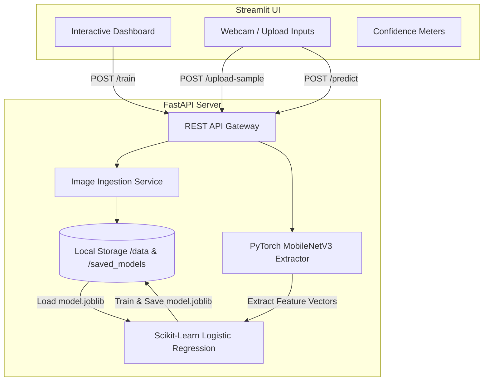

# Technable Machine: Decoupled AI Transfer Learning Platform

Technable Machine is a full-stack, decoupled AI classification platform inspired by Google's Teachable Machine. It enables developers and students to build custom image classifiers on-the-fly directly from a web interface, running transfer learning backends in real-time.

This project is built using a **FastAPI** backend for high-performance ML workloads and a **Streamlit** frontend for interactive dataset collection and testing.

---

## 📐 Architecture Overview

The system is fully decoupled into a client-server architecture:



### 🧠 The ML Pipeline & Transfer Learning Explained
1. **Pre-processing Uniformity**: Images uploaded during dataset collection or passed in real-time for predictions are processed using identical dimensions. They are scaled to $224 \times 224$ pixels and normalized against ImageNet's default channel mean and standard deviation:
   - Mean: `[0.485, 0.456, 0.406]`
   - Std Dev: `[0.229, 0.224, 0.225]`
2. **Feature Extraction**: Instead of training a deep convolutional network from scratch (which requires massive datasets and high-performance GPUs), we leverage **MobileNetV3 Large**. MobileNetV3 acts as a *feature extractor* by replacing its final classifier layer with an `Identity` layer, yielding a high-quality 960-dimensional structural feature representation.
3. **Classifier Training**: Over these extracted 960-dimensional features, we train a **Logistic Regression** classifier from `scikit-learn`. This step fits a linear decision boundary in milliseconds, enabling instant training.
4. **Model Persistence**: Once training is complete, the Logistic Regression model weights and the custom class mapping dictionary are saved locally to disk (`model.joblib` and `class_mapping.joblib`).

---

## 🚀 Getting Started

Follow these instructions to set up the FastAPI backend locally on Windows using Anaconda.

### Prerequisites
- Windows 10/11
- Anaconda (or Miniconda) installed
- Python 3.13 (default Anaconda environment Python version or custom env)

### 1. Environment Setup
Open Anaconda Prompt (or PowerShell configured with conda) and run the following:

```powershell
# Create a new environment with Python 3.13
conda create -n technable python=3.13 -y

# Activate the environment
conda activate technable
```

### 2. Install Dependencies
Navigate to the project root directory and run:

```powershell
# Navigate to the backend folder
cd backend

# Install dependencies using pip
pip install -r requirements.txt
```

### 3. Run the Backend API
Start the FastAPI server using `uvicorn`:

```powershell
# Run the application with hot-reloading active
uvicorn app.main:app --host 127.0.0.1 --port 8000 --reload
```

The terminal will print:
```text
INFO:     Started server process [1234]
INFO:     Waiting for application startup.
[INFO] app.main: FastAPI Teachable Machine backend starting up...
[INFO] app.main: Pre-warming PyTorch MobileNetV3 model...
[INFO] app.services.ml_service: Model successfully loaded. Running on device: cpu
INFO:     Uvicorn running on http://127.0.0.1:8000 (Press CTRL+C to quit)
```

---

## 📡 API Endpoints & Request Flow

Once running, access the interactive API docs at **`http://127.0.0.1:8000/docs`** (Swagger UI).

### Endpoints Reference

| Method | Endpoint | Description | Request Format | Response |
| :--- | :--- | :--- | :--- | :--- |
| **GET** | `/health` | Hardware acceleration and API health | None | `HealthResponse` |
| **GET** | `/dataset-status` | Get categories and sample counts | None | `TrainingStatusResponse` |
| **POST** | `/upload-sample` | Upload images to a specific category | Form (`class_name`) + File | `UploadSamplesResponse` |
| **POST** | `/train` | Run transfer learning feature extraction | None | `GenericResponse` |
| **POST** | `/predict` | Classify a single test image | File | `PredictionResponse` |
| **POST** | `/clear` | Clear all dataset folders and model weights | None | `GenericResponse` |

### Step-by-Step Flow

#### Step A: Upload Image Samples
Send image files to the `/upload-sample` endpoint to populate folders inside `backend/data/`:
```bash
curl -X 'POST' \
  'http://127.0.0.1:8000/upload-sample' \
  -H 'accept: application/json' \
  -H 'Content-Type: multipart/form-data' \
  -F 'class_name=Mask' \
  -F 'files=@my_face_with_mask.jpg'
```

#### Step B: Train Model
Once at least 2 distinct categories contain images, trigger the `/train` endpoint:
```bash
curl -X 'POST' \
  'http://127.0.0.1:8000/train' \
  -H 'accept: application/json'
```

#### Step C: Inference & Prediction
Test the trained model by sending a single image to the `/predict` endpoint:
```bash
curl -X 'POST' \
  'http://127.0.0.1:8000/predict' \
  -H 'accept: application/json' \
  -H 'Content-Type: multipart/form-data' \
  -F 'file=@test_image.jpg'
```

Response format:
```json
{
  "predicted_class": "Mask",
  "confidence": 0.9856,
  "all_confidences": {
    "Mask": 0.9856,
    "No_Mask": 0.0144
  }
}
```

---

## 🛠️ Troubleshooting & Developer Details

### OpenMP Conflict Crash (libiomp5md.dll)
In some Windows Anaconda environments, importing PyTorch triggers a duplicate OpenMP runtime crash.
- **Solution**: We have already integrated `os.environ["KMP_DUPLICATE_LIB_OK"] = "TRUE"` inside `app/core/config.py` to prevent this conflict.

### Upload Limits
FastAPI handles large file uploads efficiently. However, when uploading hundreds of webcam frames, send them in smaller batches (e.g., 20-30 images per request) to prevent network timeouts.

---

## 🔮 Future Improvements (Phase 2)
- Build a premium glassmorphic Streamlit UI replicating Google's Teachable Machine workflow.
- Integrate WebRTC camera inputs for real-time video stream predicting.
- Package both services into a unified `docker-compose.yml` configuration.
