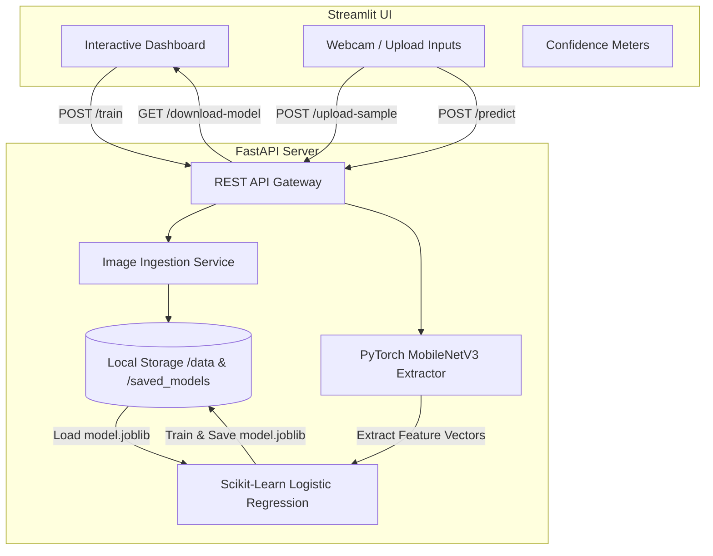

# 🧠 Technable Machine: Decoupled AI Transfer Learning Platform


Technable Machine is a full-stack, decoupled AI classification platform inspired by Google's Teachable Machine. It enables developers and students to build custom image classifiers on-the-fly directly from a web interface, running transfer learning backends in real-time.

---

## 📸 Application Screenshots
*(Replace these placeholders with actual screenshots of your running application)*

| Dataset Ingestion | Real-Time Prediction |
|:---:|:---:|
|  |  |

---

## 📐 Architecture & Workflow

The system is fully decoupled into a client-server architecture:



---

## 📡 API Endpoints

The FastAPI backend exposes the following REST capabilities:

| Method | Endpoint | Description | Request Format |
| :--- | :--- | :--- | :--- |
| **GET** | `/health` | Hardware acceleration and API health | None |
| **GET** | `/dataset-status` | Get categories and sample counts | None |
| **POST** | `/upload-sample` | Upload images to a specific category | Form (`class_name`) + File |
| **POST** | `/train` | Run transfer learning feature extraction | None |
| **POST** | `/predict` | Classify a single test image | File |
| **POST** | `/clear` | Clear all dataset folders and model weights | None |
| **GET** | `/download-model`| Download the trained `.joblib` model | None |

---

## 🚀 Getting Started

Please see the [LOCAL_SETUP_GUIDE.md](./LOCAL_SETUP_GUIDE.md) for step-by-step instructions on running the dual-server architecture on your machine.

If you encounter issues, refer to the [TROUBLESHOOTING.md](./TROUBLESHOOTING.md).

For a detailed breakdown of the machine learning pipeline, see the [FINAL_PROJECT_SUMMARY.md](./FINAL_PROJECT_SUMMARY.md).

---

## 📁 Repository Structure

```text
technable_machine_project/
├── backend/
│   ├── app/
│   │   ├── core/           # Settings, logging, env variables
│   │   ├── models/         # Pydantic schemas for API
│   │   ├── routes/         # FastAPI endpoints (predict, train, etc.)
│   │   └── services/       # ML logic and filesystem handling
│   ├── data/               # Raw uploaded datasets (ignored in git)
│   ├── saved_models/       # .joblib artifacts (ignored in git)
│   ├── .env.example        # Environment variable templates
│   └── requirements.txt    # Backend dependencies
├── frontend/
│   ├── components/         # Modular Streamlit UI components
│   ├── services/           # Python Requests API wrappers
│   ├── styles/             # Custom CSS glassmorphic styles
│   ├── utils/              # Helper formatters and image ops
│   ├── app.py              # Streamlit entry point
│   └── requirements.txt    # Frontend dependencies
├── DEMO_SCRIPT.md          # Guide for presenting the app
├── FINAL_PROJECT_SUMMARY.md
├── LOCAL_SETUP_GUIDE.md
└── TROUBLESHOOTING.md
```

---

## 🔮 Future Improvements
- Integrate WebRTC camera inputs for actual continuous video stream predicting (currently relies on rapid frame capture).
- Package both services into a unified `docker-compose.yml` configuration.
- Implement more robust data augmentation strategies during the transfer learning phase.
